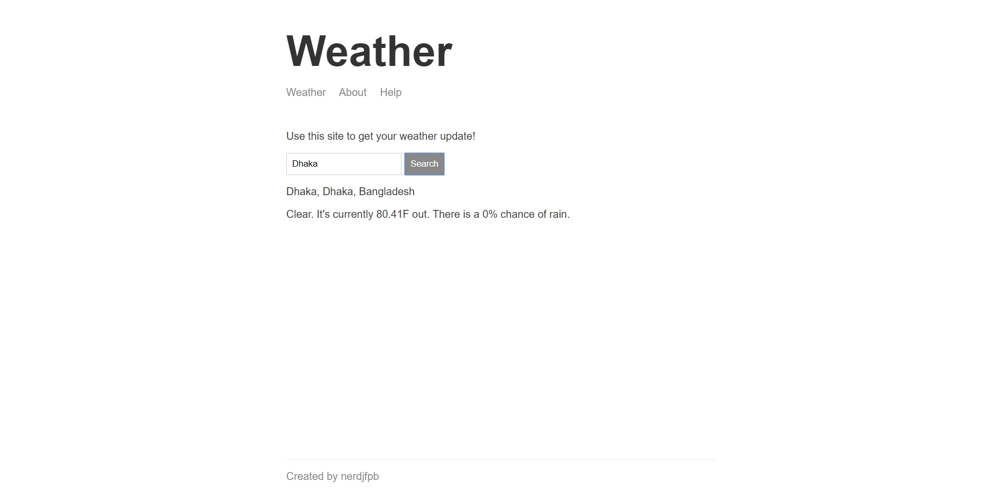

# Weather Apps Using Node JS {Express JS} & handlebars

A simple weather app using darksky & mapbox api for get the data and handle endpoints in express JS.

## Live Link

* [weather app](https://simple-weather-app-nerdjfpb.herokuapp.com/) - Simple Weather App


## Screenshot




## How to run the code ?
Download files then run
```
npm install
```
For run
```
npm start
```